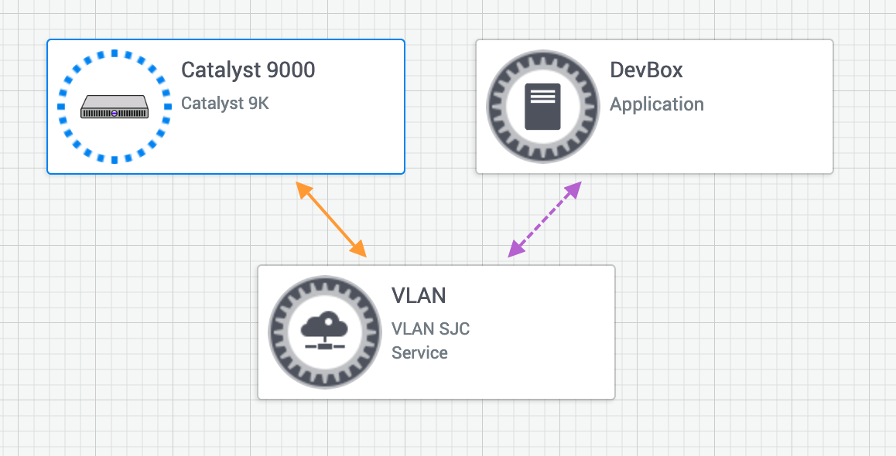

# App Hosting - MQTT Broker on the Cat 9K
## Requirements
- A DevNet Sandbox reservation (https://devnetsandbox.cisco.com/RM/Diagram/Index/8601924a-4d27-4f46-8cde-a73c5892ab48?diagramType=Topology)
- Docker installed on your desktop/laptop/work machine (https://www.docker.com/)
- VPN Client installed on your desktop/laptop/work machine (openconnect, anyconnect, etc.)


## 1 - Reserving a Sandbox
Create a reservation for the following DevNet Sandbox (https://devnetsandbox.cisco.com/RM/Diagram/Index/8601924a-4d27-4f46-8cde-a73c5892ab48?diagramType=Topology). This sandbox will grant you access to a physical Cat 9k Switch and a CentOS VM. Once the reservation is ready, you'll receive an email with VPN credentials to access the Sandbox environment. 



## 2 - Creating the MQTT Broker Application

### Laptop
On your laptop that has Docker installed, download the Eclipse MQTT image. 
```
docker pull eclipse-mosquitto
```
Once downloaded, you can export the image to a tar file... which will be used later for installing it directly on the Cat 9k switch. To export the Docker image, run the following command.
```
docker save eclipse-mosquitto:latest -o mqttbroker.tar
```

## 3 - Connecting to the Sandbox
Connect to the Sandbox VPN with your VPN client on your laptop.

### Catalyst 9000 Credentials and Information:

    Catalyst 9000 Host: 10.10.20.100 (After VPN connection)
    SSH Port: 22
    NETCONF Port: 830
    RESTCONF Ports: 443 

    Username: developer
    Password: C1sco12345

### Developer Box Credentials and Information:

    IP: 10.10.20.20 (After VPN connection)
    Username: developer
    Password: C1sco12345

## 4 - Getting the MQTT Broker App onto the Switch


### Laptop
Once connected to the Sandbox, the next step is to copy the ```mqttbroker.tar``` file to the Developer Box. 
You can do this by running the scp command on linux/unix. 
```
scp mqttbroker.tar developer@10.10.20.20:~/
```


### Developer Box
SSH into the Developer Box and configure permissions on the mqttbroker.tar file (this might not be needed... but we'll do it anyways). 
```
ssh developer@10.10.20.20
```
```
sudo chmod 777 mqttbroker.tar
```

### Cat 9k

SSH into the Cisco Cat 9k
```
ssh developer@10.10.20.100
```

Copy the ```mqttbroker.tar``` file from the Developer Box.
```
copy scp: usbflash1: vrf Mgmt-vrf
```

    Address or name of remote host [10.10.20.20]?
    Source username [developer]?
    Source filename [mqttbroker.tar]?
    Destination filename [mqttbroker.tar]?


## 5 - Configuring the Switch for the MQTT Broker
The application is configured with a static IP address and a default gateway to route the traffic from and to the application. Docker runtime params can also be provided in the run-opts command. 

### Cat 9k
    conf t
        app-hosting appid mqttbroker
        app-vnic AppGigEthernet vlan-access
        vlan 4000 guest-interface 0
        guest-ipaddress 10.10.20.102 netmask 255.255.255.0
        app-default-gateway 10.10.20.254 guest-interface 0
        app-resource docker
        run-opts "--restart=unless-stopped -p 1883:1883/tcp -p 9001:9001/tcp"
    end


## 6 - Installing, Acivating, Starting the MQTT Broker 

### Cat 9k

    app-hosting install appid mqttbroker package usbflash1:mqttbroker.tar
    app-hosting activate appid mqttbroker
    app-hosting start appid mqttbroker


## 7 - Testing the MQTT Broker

You should now be able to access the MQTT broker at 10.10.20.102 and on it's default port of 1883. Use your mqtt client of choice to test connectivity. 

```
mosquitto_sub -d -h 10.10.20.102 -t '#'
```

```
mosquitto_pub -d -p 1883 -h 10.10.20.102 -t hello -m '{"ts":2588697198242,"counts":{"person":1,"vehicle": 3}}'
```
